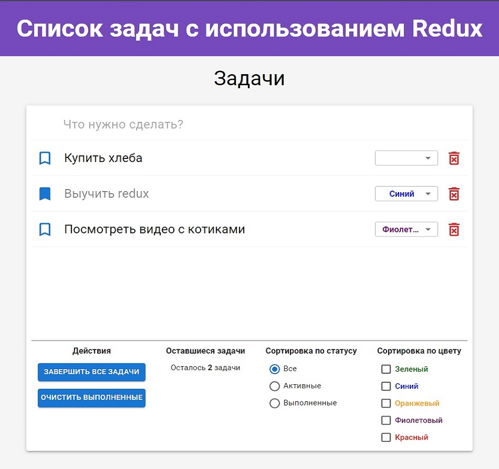
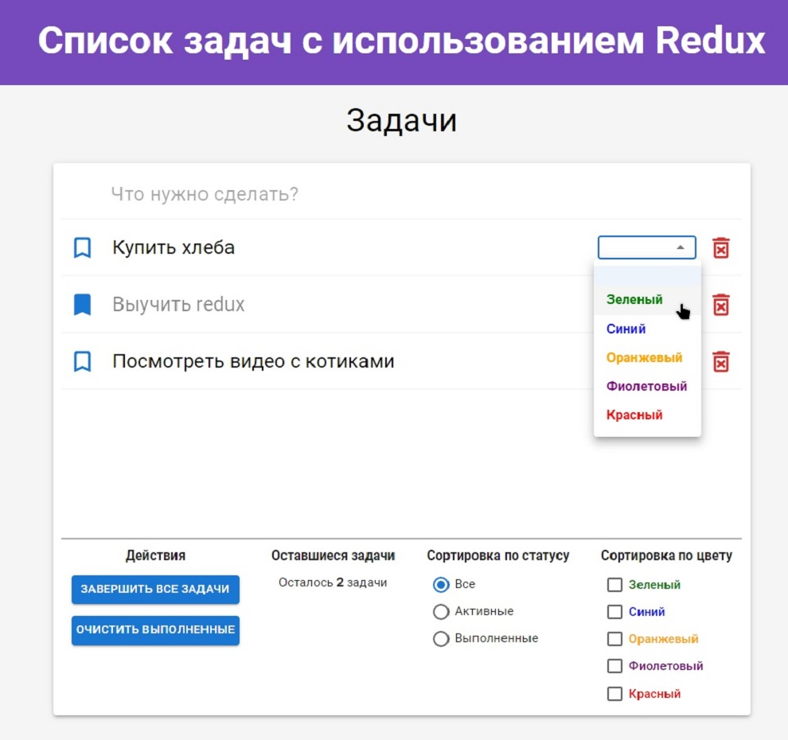
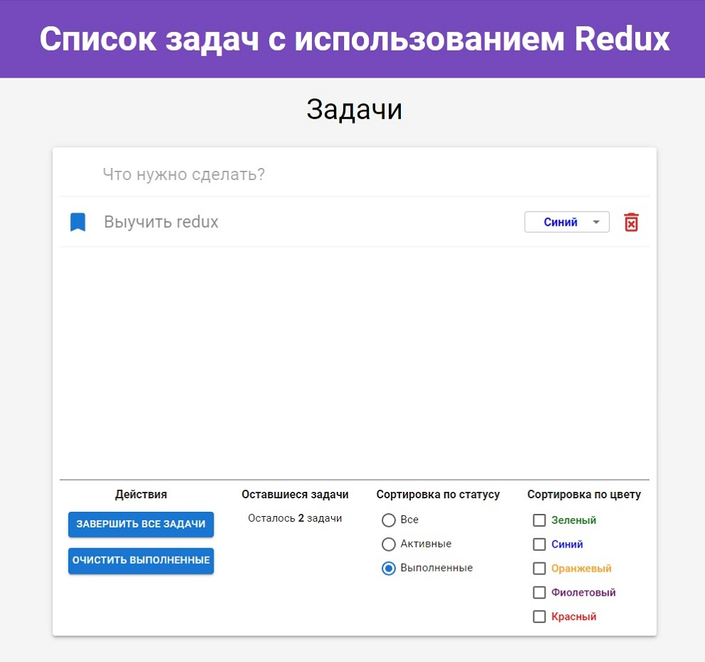
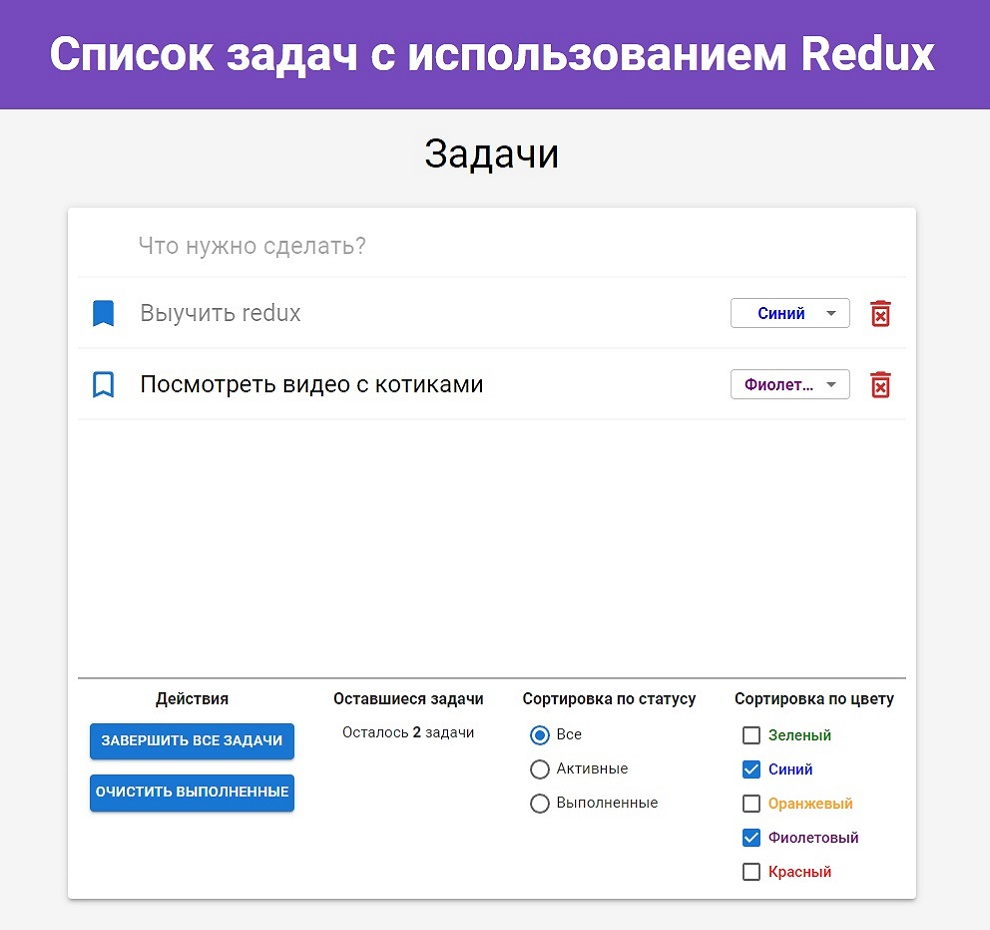

# Список задач React + Redux/Redux Toolkit


**О проекте:**<br>
Приложения список задач, созданное в качестве учебного пособия по Redux и Redux Toolkit.<br>


**Функционал:**<br>
Приложение состоит из списка задач и панели упаравления.<br>

В списке задач можно пометить определенную задачу как выполненную, 
для этого необходимо нажать на иконку флажка слева. 
Для удаления задачи, необходимо нажать на иконку удаления справа.<br>
Так же для каждой задачи можно установить ее цвет. Цвет выбирается
в соответствующем списке у каждой задачи.
<br><br>
В панели управления есть возможность пометить все задачи как завершенные 
или удалить все выполненные задачи. Так же в панели управления доступны два 
режима фильтрации задач: по статусу и по цвету. Режимы сортировки можно комбинировать.

**Используемый стек:**
* React
* Redux / Redux Toolkit
* Scss
* Material UI


## Изображения

### Начальный экран


### Выбор цвета для задачи


### Фильтрация по статусу


### Фильтрация по цвету



## Установка

```bash
git clone https://github.com/Krasivoe/todo-react-redux.git
cd todo-react-redux
npm install
```

## Сборка development

```bash
npm start
```

## Сборка production

```bash
npm run build
```
